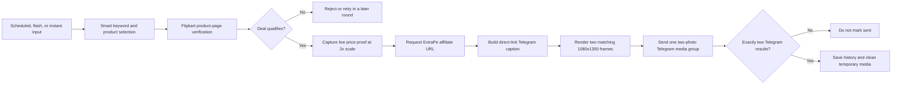

<div align="center">

# Deal Hunter Bot

### Automated Flipkart deal discovery, affiliate conversion, and professional Telegram publishing

[](https://www.python.org/)
[](https://flask.palletsprojects.com/)
[](https://core.telegram.org/bots/api)
[](https://playwright.dev/python/)
[](https://pytest.org/)

Discover high-value Flipkart deals, verify their live product data, generate affiliate URLs, and publish polished two-photo Telegram albums from one local dashboard.

</div>

> [!IMPORTANT]
> This project automates browser and Telegram activity. Use it only with accounts, channels, affiliate programs, and product data you are authorized to access. Follow Flipkart, Telegram, ExtraPe, and applicable advertising/disclosure rules.

## Overview

Deal Hunter Bot is a self-hosted Python automation system for deal-channel operators. It combines scheduled and flash-deal discovery with product-page verification, adaptive keyword selection, affiliate-link conversion, priority-based posting, and a password-protected management dashboard.

Each accepted deal is published as one strict Telegram media group containing:

1. A branded frame with the actual product image.
2. A matching live-price proof frame with the Flipkart snapshot, price, MRP, discount, rating, and verification time.

Both images use the same `1080 × 1350` portrait format. If the bot cannot prepare and deliver both images, it holds the post instead of silently sending an incomplete one-photo result.

## Highlights

| Area | Capabilities |
|---|---|
| Deal discovery | Multi-keyword Flipkart scraping, configurable pages, discount filters, buyer/rating checks, scheduled rounds, and duplicate prevention |
| Smart selection | Priority, historical yield, freshness, exploration, and category diversity influence keyword selection |
| Product verification | Product JSON-LD, live title/image/price/MRP/discount/rating validation, and protection against Similar Products contamination |
| Professional media | Matching product and price-proof cards, high-resolution Flipkart CDN images, 2× screenshot capture, and consistent branding |
| Telegram delivery | Exact two-file `sendMediaGroup`, response validation, multiple channels, controlled queue delay, and no false sent status |
| Affiliate workflow | ExtraPe Telegram userbot integration, inline-button URL extraction, timeout handling, and encoded affiliate-parameter fallback |
| Priority automation | Bounded priority queue, stable ordering, flash-deal precedence, adaptive polling, cooldowns, and backpressure |
| Dashboard | Settings, channels, categories, flash keywords, Instant Post, live logs, system statistics, and credential management |
| Reliability | Per-thread browser instances, SQLite WAL mode, browser fallback, graceful shutdown, temporary-file cleanup, and health endpoint |

## How it works



## Posting behavior

The posting pipeline is intentionally strict:

- The product photo and live-price proof are rendered locally before upload.
- The direct affiliate URL is visible in the caption; it is not hidden behind `OPEN DEAL ON FLIPKART`.
- Telegram receives exactly two equal-sized local JPEG attachments in one media group.
- The caption is attached to the first image.
- A response is successful only when Telegram returns two result messages.
- Failed delivery is not stored as sent, allowing the product to be retried later.
- Frames are reused across configured channels and cleaned after all channel attempts finish.

Telegram controls the final grid presentation in each app. An exact two-item media group with equal dimensions is the supported way to obtain the symmetric side-by-side layout.

## Requirements

- Python 3.11 or newer; Python 3.11 is the recommended production version.
- Google Chrome, Microsoft Edge, or Playwright Chromium.
- A Telegram bot token.
- Telegram API ID and API hash for the ExtraPe userbot workflow.
- A Telegram channel where the bot has permission to post media.
- Windows, Linux, macOS, or Docker.

## Quick start

### 1. Clone and enter the project

```bash
git clone https://github.com/YOUR_USERNAME/deal-hunter-bot.git
cd deal-hunter-bot
```

Replace `YOUR_USERNAME` with the GitHub account or organization that hosts your fork.

### 2. Create a virtual environment

Windows PowerShell:

```powershell
python -m venv .venv
.\.venv\Scripts\Activate.ps1
python -m pip install --upgrade pip
python -m pip install -r requirements.txt
```

Linux or macOS:

```bash
python3 -m venv .venv
source .venv/bin/activate
python -m pip install --upgrade pip
python -m pip install -r requirements.txt
```

### 3. Install a browser when needed

The bot can use an installed Chrome or Edge browser. To use Playwright's managed Chromium instead:

```bash
python -m playwright install chromium
```

On Linux, install browser system dependencies if required:

```bash
python -m playwright install --with-deps chromium
```

### 4. Configure environment values

Copy the example file:

```powershell
Copy-Item .env.example .env
```

Linux or macOS:

```bash
cp .env.example .env
```

Fill the required values in `.env`, or enter supported settings through the dashboard.

```dotenv
API_ID=your_telegram_api_id
API_HASH=your_telegram_api_hash
BOT_TOKEN=your_telegram_bot_token
EXTRAPE_AFFID=your_affiliate_id
EXTRAPE_PARAM1=your_tracking_parameter
FLASK_SECRET_KEY=replace_with_a_long_random_secret
ENCRYPTION_KEY=replace_with_a_private_local_encryption_key
```

Generate a Flask session secret with Python:

```bash
python -c "import secrets; print(secrets.token_hex(32))"
```

> [!WARNING]
> Never commit `.env`, `database/bot_data.db`, Telegram session files, tokens, API hashes, affiliate identifiers, or production logs. The included `.gitignore` excludes these local artifacts.

### 5. Authorize the ExtraPe userbot

```bash
python login_userbot.py
```

Complete Telegram's interactive login. The generated session stays local and is ignored by Git.

### 6. Start the application

```bash
python main.py
```

The dashboard is available at:

```text
http://127.0.0.1:8000
```

Do not expose Flask's development server directly to the public internet. Use a production WSGI server and reverse proxy for a public deployment.

## First dashboard login

A new database does not create a known default password. Initialize the local
dashboard account explicitly with:

```bash
python reset_dashboard_login.py
```

Enter a new login ID and a password of at least 12 characters containing a
letter and number, then restart `main.py`. Existing databases keep their current
credentials until this reset command is run.

## Dashboard setup checklist

After signing in:

1. Open **Settings** and save Telegram/ExtraPe configuration.
2. Open **Channels** and add the target channel ID, such as `@channel_name`.
3. Make the Telegram bot an administrator with permission to post media.
4. Add categories, keywords, minimum discounts, and priority levels.
5. Configure flash keywords only for products that need accelerated monitoring.
6. Keep a practical worker count for the available RAM.
7. Use **Instant Post** to process a specific Flipkart product URL through the same verified two-photo pipeline.

The professional two-photo mode is always enabled. A frame or proof failure holds the post rather than degrading to one photo.

## Configuration reference

| Setting | Purpose | Typical default |
|---|---|---|
| `API_ID` / `API_HASH` | Telegram user API credentials used by Telethon | Required for ExtraPe |
| `BOT_TOKEN` | Telegram Bot API token used for channel posts | Required |
| `EXTRAPE_AFFID` | Affiliate identifier used by ExtraPe/fallback URL generation | User supplied |
| `EXTRAPE_PARAM1` | Affiliate tracking parameter | User supplied |
| `FLASK_SECRET_KEY` | Persistent secure dashboard sessions | Required outside throwaway local tests |
| `ENCRYPTION_KEY` | Optional local encryption key for dashboard-stored sensitive values | Recommended |
| `MIN_BUYERS_COUNT` | Minimum verified rating/buyer count | `1000` |
| `MAX_SCRAPE_PAGES` | Maximum pages inspected per keyword | `3` |
| `MAX_WORKERS` | Concurrent keyword scrapers | `2` |
| `KEYWORDS_PER_ROUND` | Keywords selected in each database rotation | `4` |
| `QUEUE_DELAY_POST` | Delay between deal posting attempts | `15` seconds |
| `ALLOW_MISSING_BUYERS` | Whether missing buyer counts can qualify | `OFF` |
| `DEFAULT_POST_FORMAT` | Caption style for normal deals | `hot_deal` |
| `FLASH_POST_FORMAT` | Caption style for flash deals | `mega_loot` |

## Priority and scheduling

Deals enter a bounded priority queue rather than being posted immediately by scraper workers.

- Flash and urgent deals receive the strongest posting priority.
- Higher-value category priorities influence scoring and queue order.
- Equal priorities preserve timestamp order.
- Affiliate conversion and Telegram publishing occur sequentially in the consumer.
- `QUEUE_DELAY_POST` reduces channel bursts and Telegram rate-limit risk.
- Flash polling becomes faster after successful discoveries and slower after empty checks.

See [IMPLEMENTATION_CHANGES.md](IMPLEMENTATION_CHANGES.md) for the detailed queue, scoring, retry, and failure flow.

## Project structure

```text
deal-hunter-bot/
├── analyzer/                  # Deal scoring, trend helpers, smart keyword selection
├── dashboard/                 # Flask app, routes, and templates
├── database/                  # SQLite schema and persistence helpers
├── scraper/                   # Browser pool, Flipkart parsing, live price screenshots
├── telegram/                  # Captions, media frames, and Telegram delivery
├── tests/                     # Unit and regression tests
├── userbot/                   # ExtraPe Telethon integration
├── config.py                  # Environment/database configuration loading
├── login_userbot.py           # Interactive Telegram user authorization
├── reset_dashboard_login.py   # Safe dashboard credential reset
├── main.py                    # Scheduler, queue, consumer, dashboard startup
├── Dockerfile                 # Python 3.11 container image
├── requirements.txt           # Python dependencies
└── IMPLEMENTATION_CHANGES.md  # Detailed implementation and operational notes
```

Runtime folders such as `temp_screenshots/`, `temp_media_frames/`, `tmp/`, and `output/` are generated locally and excluded from Git.

## Run with Docker

Build the image:

```bash
docker build -t deal-hunter-bot .
```

Run it with a local environment file and persistent data mounts:

```bash
docker run --name deal-hunter-bot \
  --env-file .env \
  -p 8000:8000 \
  -v "$(pwd)/database:/app/database" \
  -v "$(pwd)/userbot:/app/userbot" \
  deal-hunter-bot
```

On PowerShell, use absolute Windows paths for the two volume mounts. Protect the mounted database, `.env`, and userbot session directory.

The container exposes port `8000` and checks `/health` for application health.

## Tests

Run the full test suite:

```bash
python -m pytest -q
```

Compile-check the source without starting the bot:

```bash
python -m compileall -q analyzer dashboard database scraper telegram userbot main.py
```

Regression coverage includes:

- product JSON-LD and aggregate rating extraction;
- Similar Products price/MRP isolation;
- fake price-drop rejection;
- adaptive keyword scoring and diversity;
- exact two-file Telegram albums and partial-result rejection;
- direct affiliate caption output;
- matching professional media dimensions;
- database, queue, parser, and ExtraPe behaviors.

Tests mock Telegram delivery. They do not need to send a dummy message to a production channel.

## Security notes

- Dashboard passwords are stored as bcrypt hashes.
- Sensitive dashboard settings can be encrypted when `ENCRYPTION_KEY` is configured.
- SQLite uses parameterized statements for credential updates.
- Flipkart's HTTPS-tolerant image fallback is restricted to known Flipkart CDN hostnames.
- Product images are size-limited and decoded before frame generation.
- Temporary proof/frame files are removed after delivery attempts.
- The repository ignores local databases, sessions, environment files, logs, and generated output.
- Rotate any credential immediately if it was previously committed or shared.

Before making the repository public, review the complete Git history—not only the current files—for leaked tokens or sessions.

## Troubleshooting

<details>
<summary><strong>The dashboard does not accept my login</strong></summary>

Run `python reset_dashboard_login.py`, enter the new credentials, stop the running process with `Ctrl+C`, and restart `python main.py`.

</details>

<details>
<summary><strong>Only one Telegram photo appears</strong></summary>

Restart the bot to load the latest code and inspect the log for `Professional 2-photo album sent`. The strict production path does not accept a one-message Telegram result. Verify Pillow is installed and Flipkart product/media URLs are reachable.

</details>

<details>
<summary><strong>The screenshot contains another product's price</strong></summary>

The current semantic detector excludes content after `Similar Products` and binds MRP/discount to the target current price. If Flipkart changes its DOM, update semantic detection without reintroducing a generic first-price or page-wide maximum fallback.

</details>

<details>
<summary><strong>ExtraPe does not return a URL</strong></summary>

Check `API_ID`, `API_HASH`, the Telethon authorization created by `login_userbot.py`, and ExtraPe availability. The bot waits for URLs in message text and inline buttons, then uses encoded affiliate fallback parameters when necessary.

</details>

<details>
<summary><strong>Playwright says the browser executable is missing</strong></summary>

Install Chrome/Edge or run `python -m playwright install chromium`. The browser pool automatically falls back to supported installed browsers when Playwright Chromium is unavailable.

</details>

<details>
<summary><strong>Dashboard sessions reset after every restart</strong></summary>

Set a stable, private `FLASK_SECRET_KEY` in `.env`. The temporary startup key is intended only for local testing.

For the recommended one-time setup, run:

```powershell
python scripts/secure_local_secrets.py
```

This generates master keys outside the repository (on Windows,
`%LOCALAPPDATA%\DealHunterBot\.env`) and migrates API, bot, and affiliate
settings from plaintext/legacy database values to versioned Fernet ciphertext.
Set `DEAL_HUNTER_ENV_FILE` when a deployment needs a different private path.
The ExtraPe Telethon session is also stored under the same private OS-local
directory rather than inside the repository.
The dashboard never renders stored credential values back into its HTML; blank
secret fields preserve the existing encrypted value.

</details>

## Operational documentation

Detailed implementation decisions, failure guarantees, file responsibilities, and verification notes are maintained in:

- [IMPLEMENTATION_CHANGES.md](IMPLEMENTATION_CHANGES.md)

Keep that document updated whenever the scraper, affiliate workflow, frame design, queue policy, or delivery guarantees change.

## Contributing

1. Create a branch for the change.
2. Keep secrets and runtime artifacts out of Git.
3. Add regression tests for parser, selector, queue, or delivery changes.
4. Run `python -m pytest -q` and the compile check.
5. Document user-visible behavior changes.
6. Open a pull request with the problem, approach, verification, and any migration steps.

## License

No open-source license file is currently included. Add an appropriate `LICENSE` before allowing redistribution or third-party reuse. Without a license, normal copyright restrictions apply.

---

<div align="center">

Built for reliable, transparent, and visually consistent Telegram deal automation.

</div>
